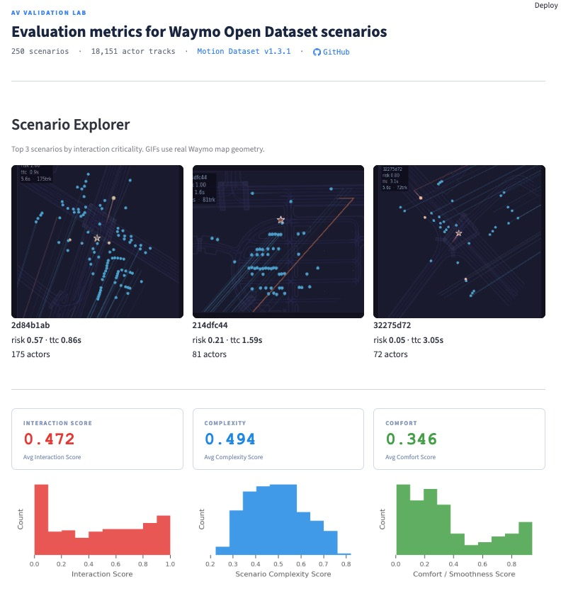
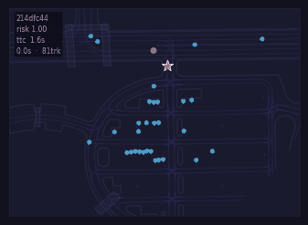
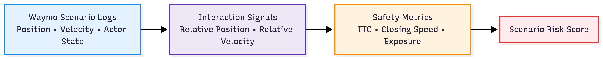

# AV Validation Lab

**Evaluation metrics derived from the Waymo Open Dataset.**

A local-first analytics pipeline that parses real AV scenario recordings, computes interaction, complexity, and comfort scores, and surfaces the results in an interactive Streamlit dashboard.

> ⚠️ The Waymo Open Dataset is **not included**. You must download it separately. See [Local Setup](docs/LOCAL_SETUP.md).

---

## Why this exists

Autonomous vehicle datasets contain thousands of complex multi-actor interactions.  
However, inspecting these scenarios manually is difficult and existing tools often
require heavy ML stacks or custom infrastructure.

This project builds a lightweight validation pipeline that extracts interpretable
safety signals from real Waymo Open Dataset scenarios — such as interaction
intensity, time-to-collision, and comfort metrics — and surfaces them through an
interactive scenario explorer.

The goal is to make AV scenario analysis transparent, reproducible, and easy to
inspect without requiring large ML frameworks.

---

## Architecture Overview

The project has two logical components:

**App (local pipeline)**  
Runs the full workflow:
- parses Waymo TFRecord scenario files
- generates structured parquet tables
- computes interaction, risk, and comfort metrics
- generates preview GIFs
- launches the Streamlit dashboard

**WebApp (visualization layer)**  
The dashboard itself is a visualization layer that reads precomputed artifacts:

- `data/gold/*.parquet`
- `data/previews/*.gif`

The WebApp does **not parse TFRecords or run the pipeline**.  
It simply visualizes the computed scenario metrics.

---

## Screenshot



---

## What it does

- Parses raw Waymo TFRecord scenario files (zero TensorFlow)
- Computes three per-scenario scores: **Interaction Score**, **Complexity Score**, **Comfort Score**
- Renders an interactive dashboard with scenario previews, metric summaries, and an interactive scatter map
- Currently processes **250 scenarios · 18,151 actor tracks** from the Waymo validation split

---

## Scenario Explorer

Animated previews of high-interaction scenarios extracted from the Waymo dataset.



---

## Architecture



```
Raw TFRecords (local, not in repo)
    ↓  waymo_real_parser.py
Silver parquet  (scenarios, tracks, states)
    ↓  compute_*.py scripts
Gold parquet    (interaction, risk, comfort metrics)
    ↓  generate_preview_gifs.py
data/previews/  (scenario GIFs)
    ↓  scripts/app.py
Streamlit dashboard
```

---

## Key features

- Zero TensorFlow — protobuf decoded with `protoc` + standard `protobuf` Python package
- Zero synthetic data — all trajectories from real Waymo sensor recordings
- Three transparent, formula-driven scoring models (no ML black boxes)
- Interactive Plotly scatter map with hover tooltips
- Animated scenario GIF previews
- BigQuery-compatible parquet schema for future fleet-scale analysis

---

## Quick start

```bash
# 1. Clone and set up environment
git clone https://github.com/rafaelmaranon/waymo-validation-lab.git
cd waymo-validation-lab
python3.10 -m venv .venv
source .venv/bin/activate
pip install -r requirements.txt

# 2. Compile protobuf classes (once only)
protoc --proto_path=proto --python_out=proto \
  proto/waymo_open_dataset/protos/map.proto \
  proto/waymo_open_dataset/protos/scenario.proto

# 3. Place your Waymo TFRecord files at:
#    ~/datasets/waymo/raw/

# 4. Run the pipeline
python scripts/waymo_real_parser.py
python scripts/compute_basic_metrics.py
python scripts/compute_interaction_metrics.py
python scripts/compute_risk_metrics.py
python scripts/compute_comfort_metrics.py
python scripts/generate_preview_gifs.py

# 5. Launch the app
streamlit run scripts/app.py
```

Full setup instructions: [docs/LOCAL_SETUP.md](docs/LOCAL_SETUP.md)

---

## Data

This project uses the Waymo Open Dataset.

Waymo dataset files are not included in this repository. To reproduce the pipeline, download the dataset directly from Waymo and follow the setup instructions in `docs/LOCAL_SETUP.md`.

Dataset access and use are subject to the Waymo Open Dataset terms:
https://waymo.com/open/terms

This project was built using the Waymo Open Dataset provided by Waymo LLC.

---

## Docs

- [Local Setup Guide](docs/LOCAL_SETUP.md)
- [Data Pipeline](docs/DATA_PIPELINE.md)
- [Repo Structure](docs/REPO_STRUCTURE.md)
- [Deployment Notes](docs/DEPLOYMENT_STREAMLIT.md)

---

## Stack

Python 3.10 · pandas · numpy · pyarrow · protobuf · Streamlit · Plotly · matplotlib

